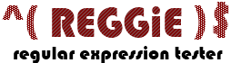

# REGGiE: Regular Expression Tester

Demonstration project for testing regular expressions, originally created ... sometime in the 2000s. Retrieved from CodePlex archived and moved to GitHub January, 2020.

Toolkit:

* .NET Framework 4
* WPF
* CaliburnMicro
* Visual Studio Tests
* Moq

